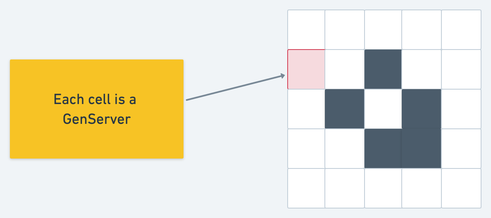
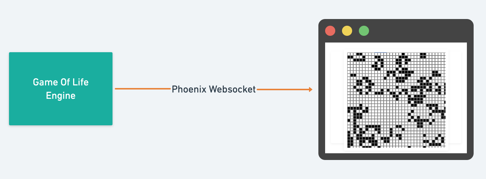
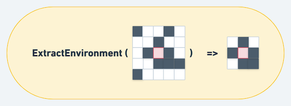
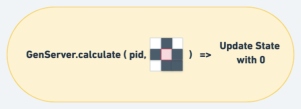
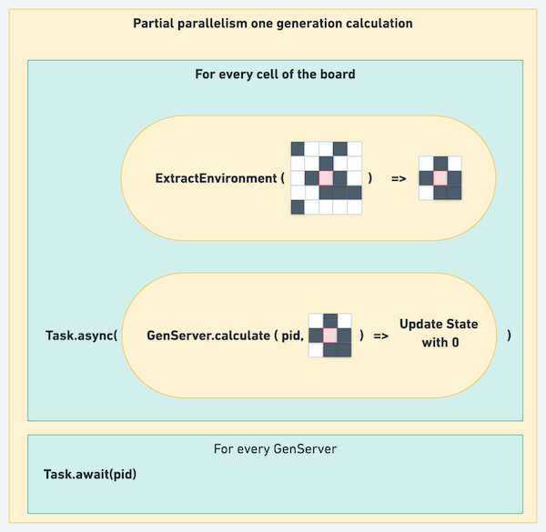
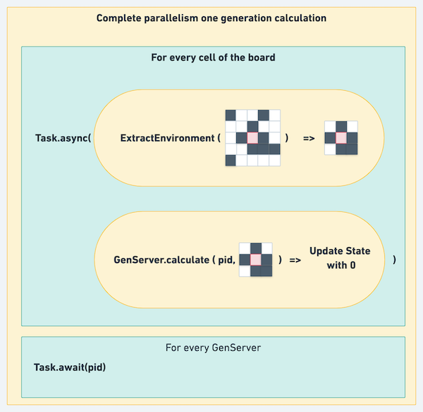
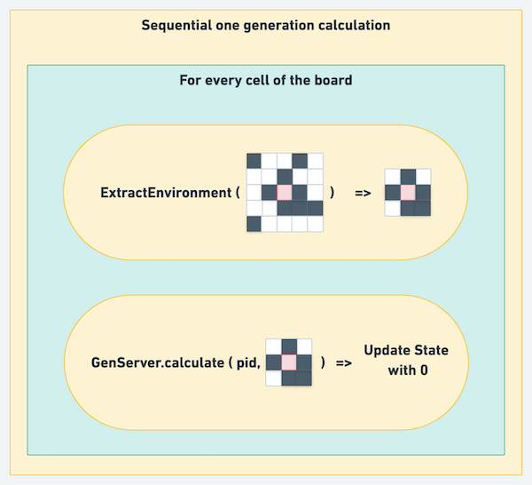

# GameOfLife.ex

The goal of this project is to play with Elixir's concurrency.
I've looked for a project allowing me to launch thousands of Genservers at once.
To do so, I came with the idea of a Game Of Life where each cell will be handled by a GenServer.
A board 100x100 will require 10.000 GenServers which begins to be interesting.

## Main parts of the project

- module GameOfLifeCore: the engine
    - generate the board
    - spawn the GenServers
    - dispatch the cell's calculation request to servers

- PhxGameOfLifeWeb.RoomChannel:
    - simple websocket using Phoenix

- The front part implemented with ReactJS in charge of displaying the grid

## Structure of the algorithm

To calculate one new generation, the same algorithm is used for every cell:
  - gathering of cell's values around it. The result is called the `environment`
  

  - sending the environment to the GenServer in charge of the Game of Life calculation
  

Based on this algorithm, I've used different strategies to make the generation calcultation faster.

## Versions to gain performance

In my quest for performance, I've ended up with different strategies.

- Version 1 - Matrix 1: First iteration with partial parallelism
    - board data structure is a tupe of tuples
    - each GenServer is called from a `Task.async`
    - the building of the environment of a cell is not in the `Task.async`
    - Time to calculate one generatin: 0.915 sec
    - **Conclusion**: it works but performance are not crazy

- Version 2 - List: Usind List data structure
    - data structure is list
    - each GenServer is called from a `Task.async`
    - the building of the environment of a cell is not in the `Task.async`
    - Time to calculate one generatin: 1.087 sec
    - **Conclusion**: I was expecting a boost from using List instead of tuple but it was the opopsite.

- Version 3 - Matrix 2: Reduce data fetching
    - data structure is a tupe of tuples
    - each GenServer is called from a `Task.async`
    - passing the board data in argument to avoid fetching it too often
    - Time to calculate one generatin: 0.440 sec
    - **Conclusion**: by reducing fetching the board state, I got an intersting performance boost!

Version 1, 2 and 3 can be summed-up like this:

- Version 4 - Matrix 3: Complete parallelism
    - data structure is a tupe of tuples
    - each GenServer is called from a `Task.async`
    - the building of the environment of a cell is in the `Task.async`
    - passing the board data in argument to avoid fetching it too often
    - Time to calculate one generatin: 1.566 sec
    - **Conclusion**: moving all the processing in the `Task.async` is disappointing I was expecting a performance boost but I got the opposite.

Version 4 can be summed-up like this:

- Version 5 - Matrix 4: No parallelism, simple sequential version
    - data structure is a tupe of tuples
    - No `Task.async`
    - passing the board data in argument to avoid fetching it too often
    - Time to calculate one generatin: 0.071 sec
    - **Conclusion**: the difference is impressive! I'm under `0.1` sec. I was expecting to get this result with parallelism!

Version 5 can be summed-up like this:

### Performance sum-up

| Version       | Calculation of one generation (in sec)  |
| ------------- |:-------------:|
| Matrix 1      | 0.915 |
| List          | 1.087 |
| Matrix 2      | 0.440 |
| Matrix 3      | 1.566 |
| Matrix 4      | 0.071 |

## Run test

`mix test`

## Start the server

To start your Phoenix server:

  * Install dependencies with `mix deps.get`
  * Install Node.js dependencies with `cd assets && npm install`
  * Start Phoenix endpoint with `mix phx.server`

Now you can visit [`localhost:4000`](http://localhost:4000) from your browser.
